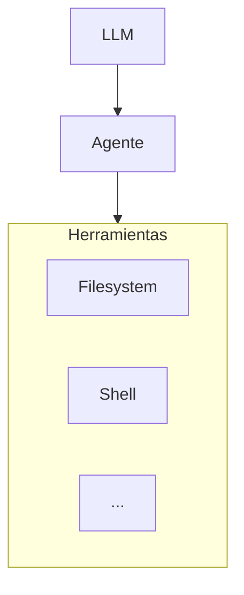
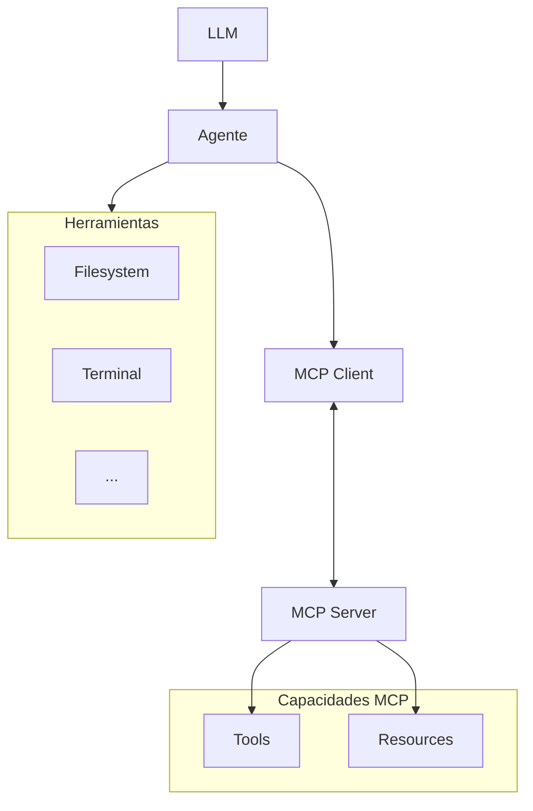
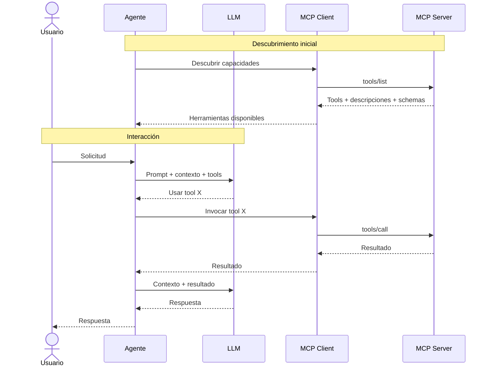
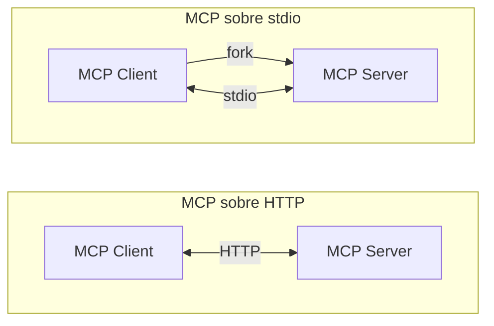

---
theme:
  path: ./theme.yaml
---

MCP
===

> ​
> ​ El agente dispone de un repertorio limitado de herramientas que le permiten acceder al filesystem, shell etc.
> ​

<!-- new_lines: 4 -->


<!-- end_slide -->

MCP
===

> ​
> ​ **MCP (Model Context Protocol)** es un protocolo que permite conectar un agente con herramientas y fuentes de información externas.
> ​

<!-- new_lines: 4 -->



<!-- end_slide -->

MCP
===

> ​
> ​ El agente descubre las capacidades del MCP y extiende su repertorio de herramientas disponibles.
> ​

<!-- new_lines: 4 -->


<!-- end_slide -->

MCP
===

> ​
> ​ El agente consulta al MCP las herramientas disponibles mediante **JSON-RPC**.
> ​

<!-- new_lines: 2 -->

Peticion:

```json
{
  "jsonrpc": "2.0",
  "id": 1,
  "method": "tools/list",
  "params": {}
}
```
Respuesta:

```json
{
  "jsonrpc": "2.0",
  "id": 1,
  "result": {
    "tools": [
      {
        "name": "get_tasks",
        "description": "Obtiene las tareas dadas de alta.",
        "inputSchema": {
          "type": "object",
          "properties": {
            "project_id": {
              "type": "integer",
              "description": "Identificador de proyecto."
            }
          },
          "additionalProperties": false
        }
      },
...
}
```

<!-- end_slide -->

MCP
===

> ​
> ​ El agente invoca una herramienta del MCP usando también **JSON-RPC**.
> ​

<!-- new_lines: 2 -->

Peticion:

```json
{
 "jsonrpc": "2.0",
  "id": 2,
  "method": "tools/call",
  "params": {
    "name": "get_tasks",
    "arguments": {
      "project_id": 42
    }
  }
}
```
Respuesta:

```json
{
  "jsonrpc": "2.0",
  "id": 2,
  "result": {
    "content": [
      {
        "type": "text",
        "text": "[{\"id\":1,\"title\":\"Diseñar API\",\"completed\":true},{\"id\":2,\"title\":\"Implementar autenticación\",\"completed\":false}]"
      }
    ]
  }
}
```

<!-- end_slide -->

MCP
===

> ​
> ​ MCP usa **JSON-RPC** sobre diferentes transportes.
> ​

<!-- new_lines: 2 -->



