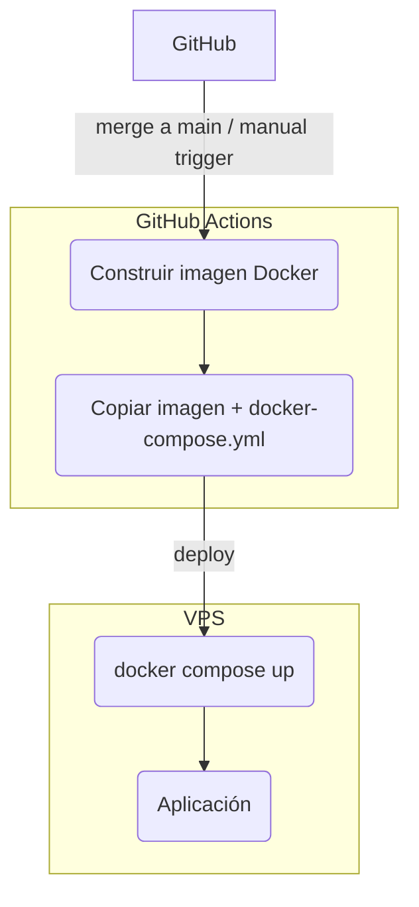

---
theme:
  path: ./theme.yaml
---

Despliegue
==========

> ​
> ​ Flujo de despliegue: de GitHub a VPS.
> ​

<!-- new_lines: 3 -->

<!-- end_slide -->

¿Después del despliegue?
========================

<!-- pause -->

> ​
> ​ Análisis de datos.
> ​

- Disponibilización de datos mediante MCP para su análisis con agentes.
- Desarrollo de agentes especializados para el análisis de datos.
- Generación de consultas, informes y visualizaciones.

<!-- pause -->

> ​
> ​ Observabilidad.
> ​

- Construcción y evolución de dashboards.
- Análisis de logs, métricas y trazas.
- Definición y afinado de reglas de alertado.

<!-- pause -->

> ​
> ​ Gestión de incidentes.
> ​

- Agrupación y correlación de alertas.
- Triage y priorización durante un incidente.
- Investigación y análisis de la causa raíz.

<!-- pause -->

> ​
> ​ Rendimiento y resiliencia.
> ​

- Caracterización de la carga para diseñar pruebas de rendimiento.
- Análisis de escenarios y cuellos de botella.
- Diseño de pruebas de estrés y caos.

