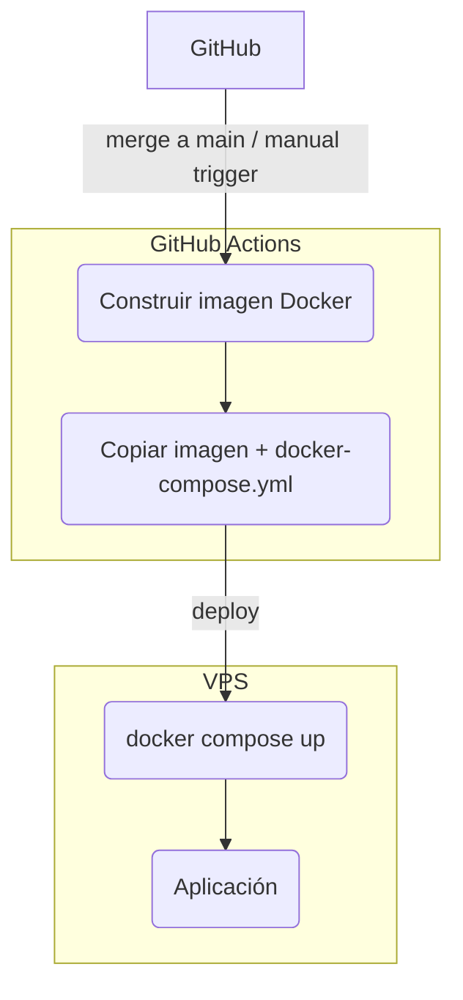

---
theme:
  path: ./theme.yaml
---

Despliegue
==========

> ​
> ​ Flujo de despliegue: de GitHub a VPS.
> ​

<!-- new_lines: 3 -->

```mermaid +render +width:80%
flowchart TB
    A[GitHub]

    subgraph CI["GitHub Actions"]
        B(Construir imagen Docker)
        C(Copiar imagen + docker-compose.yml)
        B --> C
    end

    subgraph VPS["VPS"]
        D(docker compose up)
        E(Aplicación)
        D --> E
    end

    A -->|merge a main / manual trigger| B
    C -->|deploy| D
```
